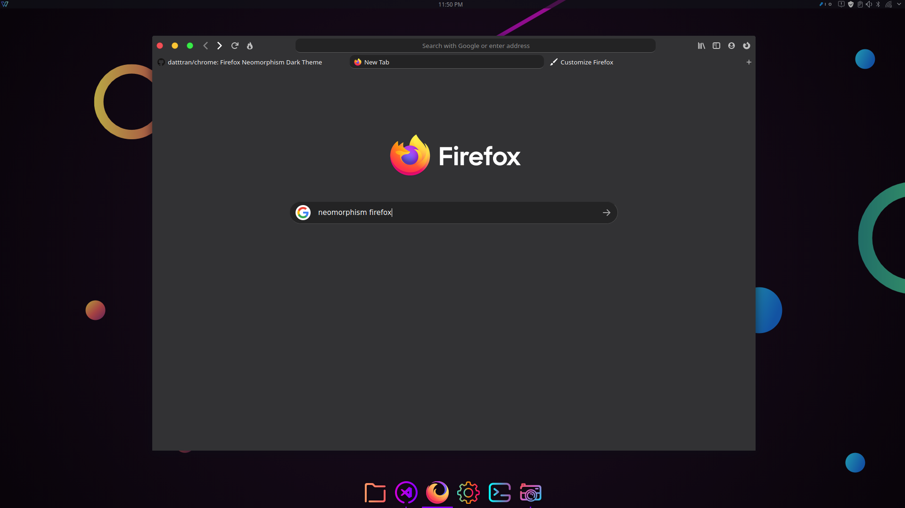

# Firefox-Mod
Tested 73.0.1 / 74.0 /  Windows 10 / Linux Default Dark Theme
# How to use
1. Go to your profile directory by typing ```about:config``` in your address bar. 

2. In side the directory, open the terminal, run:

  	```git clone https://github.com/datguypiko/Firefox-Mod.git```
	
	```mv Firefox-Mod chrome ```

3. Open a new tab in Mozilla Firefox. Type ```about:config``` in the address bar. Confirm that you will be careful if a warning message appears for you.

4. Enter the following text in the search box: toolkit.legacyUserProfileCustomizations.stylesheets.

5. Set the option ``toolkit.legacyUserProfileCustomizations.stylesheets`` to True.

6. Restart Firefox 

7. Add [OS style buttons](https://addons.mozilla.org/en-US/firefox/user/12528072/) extension

8. Enjoy the result.


You can find more in userChrome.css
```css
/* Comment this to show min/max/close buttons. I use OS style firefox plugin. */
  #TabsToolbar > .titlebar-buttonbox-container {visibility: collapse !important;}
```

```css
/* Width of the tabs. Change it to 100% to get full 
width style tabs. But it looks funny, make search 
bar transparent so it looks better with full width */
	.tabbrowser-tab[fadein]:not([pinned]) {max-width: 135px !important;}  
```  


Blur style search and bookmarks bar. Used the search method found here 

Need about:config layout.css.backdrop-filter.enabled = true
and it could need  gfx.webrender.enabled to true. But if it works with the backdrop leave this one.
```
https://www.reddit.com/r/FirefoxCSS/comments/ddi4dc/testing_the_backdropfilter_in_the_url_dropdown/
```  
 
 
 
 
 I use Flexible space for spacing https://imgur.com/a/Gd82v0H 
 # Update
 - Small change on home page UI
 
